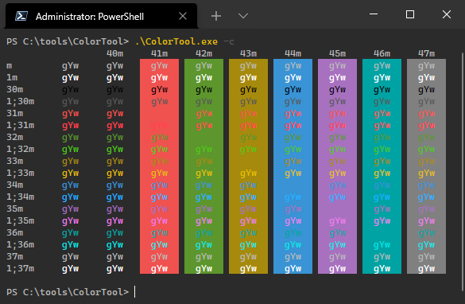

# Theme


# Color Scheme

```json
{
    "background": "#2B2B2B",
    "black": "#000000",
    "blue": "#3993D4",
    "brightBlack": "#595959",
    "brightBlue": "#1FB0FF",
    "brightCyan": "#00E5E5",
    "brightGreen": "#4FC414",
    "brightPurple": "#ED7EED",
    "brightRed": "#FF4050",
    "brightWhite": "#FFFFFF",
    "brightYellow": "#E5BF00",
    "cursorColor": "#F8F8F2",
    "cyan": "#00A3A3",
    "foreground": "#BBBBBB",
    "green": "#5C962C",
    "name": "Darcula from JB",
    "purple": "#A771BF",
    "red": "#F0524F",
    "selectionBackground": "#214283",
    "white": "#808080",
    "yellow": "#A68A0D"
}
```

# Installation
todo
